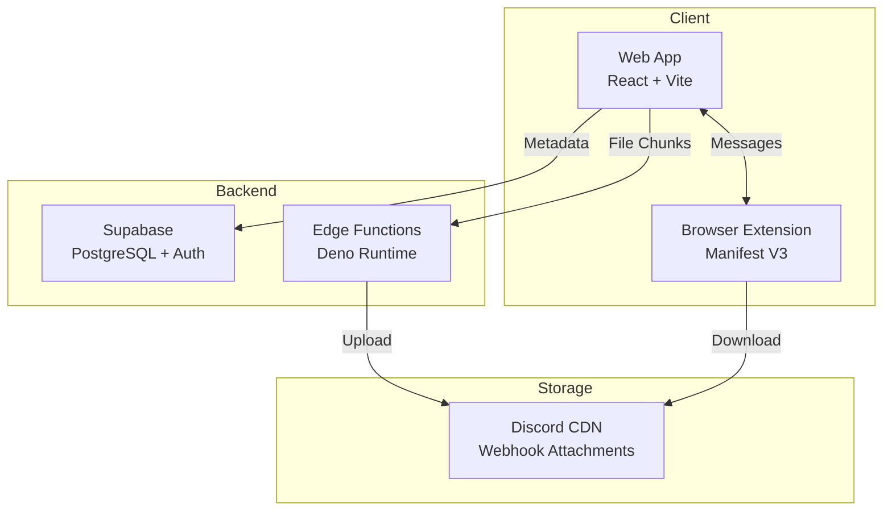

# 🐉 Wyvern Drive

[](https://github.com/Zendevve/Wyvern-Drive/releases)
[](./LICENSE)
[](./AGENTS.md)

**Discord-based cloud storage with unlimited space, zero cost, and client-side encryption.**

Wyvern Drive transforms Discord webhooks into a powerful, free cloud storage solution. Store unlimited files using Discord's CDN as your backend, with full encryption, folder management, and media streaming—all in your browser.

> **Note:** This is the **private** development repository. For the public browser extension, see [wyvern-extension](https://github.com/Zendevve/wyvern-extension).

---

## 📋 Table of Contents

- [Features](#-features)
- [Quick Start](#-quick-start)
- [Architecture](#-architecture)
- [Development](#-development)
- [Documentation](#-documentation)
- [Contributing](#-contributing)
- [License](#-license)

---

## ✨ Features

### Storage & Performance
- 🔒 **Client-Side Encryption** — AES-256-GCM, keys never leave your browser
- ♾️ **Unlimited Storage** — Use Discord's CDN for free, unlimited file storage
- ⚡ **Smart Chunking** — Dynamic 25MB chunks with parallel uploads
- 🎯 **Virtual Scrolling** — Smooth performance with 10,000+ files

### File Management
- 📁 **Full Folder System** — Create, rename, move, nested folders
- 🎨 **Drag & Drop** — Intuitive file organization
- 🔄 **File Versioning** — Keep history of document changes
- 🔍 **Advanced Search** — Filter by name, type, date

### Media & Sharing
- 🎬 **Media Streaming** — Preview images, videos, audio in-browser
- 🎵 **Persistent Player** — Continuous playback across navigation
- 🔗 **Secure Sharing** — Password-protected, time-limited links
- 📸 **Photo Timeline** — Google Photos-style gallery view

### Developer Experience
- 🌙 **Modern UI** — Discord-inspired dark theme, fully responsive
- ♿ **Accessible** — WCAG AA compliant, keyboard navigable
- 📱 **PWA Ready** — Install as native app on mobile/desktop
- 🧪 **Well Tested** — Integration tests, mocked Discord API

---

## 🚀 Quick Start

### Prerequisites

- Node.js 18+
- Supabase account ([create free](https://supabase.com))
- Discord webhook URL ([how to create](https://support.discord.com/hc/en-us/articles/228383668))

### Installation

```bash
# Clone the repository
git clone https://github.com/Zendevve/Wyvern-Drive.git
cd Wyvern-Drive

# Install dependencies
cd wyvern-web && npm install

# Set up environment variables
cp .env.example .env
# Edit .env with your Supabase credentials

# Run development server
npm run dev
```

Open **http://localhost:5173** and start uploading!

### Extension Setup (Required for Downloads)

The browser extension bypasses CORS restrictions when downloading from Discord CDN.

1. Navigate to `wyvern-extension/`
2. Load as unpacked extension in Chrome
3. See [extension README](./wyvern-extension/README.md) for details

---

## 🏗️ Architecture



### Technology Stack

| Component | Technology | Purpose |
|-----------|-----------|---------|
| **Frontend** | React 18 + TypeScript + Vite | Web UI, deployed on Netlify |
| **State** | Zustand | Global state management |
| **Styling** | CSS Modules + Custom Properties | Design system |
| **Backend** | Supabase Edge Functions (Deno) | Serverless file operations |
| **Database** | PostgreSQL (Supabase) | File metadata, users, shares |
| **Auth** | Supabase Auth | Email/password authentication |
| **Storage** | Discord CDN | Encrypted file chunks |
| **Extension** | Chrome Manifest V3 | CORS bypass for downloads |

### Project Structure

```
Wyvern Drive/
├── wyvern-web/           # React frontend
│   ├── src/
│   │   ├── components/   # UI components
│   │   ├── lib/          # Core logic (encryption, file manager)
│   │   ├── stores/       # Zustand state
│   │   └── hooks/        # React hooks
│   └── public/           # Static assets
├── wyvern-extension/     # Browser extension (separate git repo)
├── supabase/             # Backend
│   ├── functions/        # Edge Functions
│   └── migrations/       # Database schema
└── docs/                 # MCAF-compliant documentation
```

---

## 💻 Development

### Running Locally

```bash
# Terminal 1: Web app
cd wyvern-web
npm run dev

# Terminal 2: Supabase (optional local development)
cd ..
npx supabase start
```

### Building for Production

```bash
cd wyvern-web
npm run build
npm run preview  # Test production build locally
```

### Testing

```bash
# Run all tests
npm test

# Run with coverage
npm run test:coverage

# E2E tests
npm run test:e2e
```

See [Testing Strategy](./docs/Testing/strategy.md) for detailed testing guidelines.

### Code Quality

This repository follows the **[MCAF](https://mcaf.managed-code.com/)** (Managed Code AI Framework) standards.

**Quality checks:**
```bash
npm run lint        # ESLint
npm run typecheck   # TypeScript
npm run format      # Prettier
```

**Before committing:**
- ✅ All tests pass
- ✅ No linter errors
- ✅ TypeScript compiles
- ✅ Follow [AGENTS.md](./AGENTS.md) guidelines

---

## 📚 Documentation

### For Developers

- **[AGENTS.md](./AGENTS.md)** — AI agent instructions, coding standards, quality rules
- **[Architecture](./docs/Architecture/)** — System design, data flows
- **[Features](./docs/Features/)** — Feature specifications
- **[ADRs](./docs/ADR/)** — Architecture Decision Records
- **[Testing](./docs/Testing/)** — Test strategy, coverage expectations

### For Operations

- **[Deployment](./docs/Operations/deployment.md)** — Deploy to Netlify, Supabase
- **[Monitoring](./docs/Operations/monitoring.md)** — KPIs, alerts, incident response

### For Design

- **[Design System](./docs/design-system.md)** — Colors, typography, components
- **[UI/UX Laws](./docs/Design/ui-ux-laws.md)** — Cognitive psychology principles
- **[Accessibility](./docs/Design/accessibility-checklist.md)** — WCAG AA compliance
- **[Quality Checklist](./docs/Design/quality-checklist.md)** — Visual polish guidelines

### Templates

- **[Feature Template](./docs/templates/Feature-Template.md)** — Document new features
- **[ADR Template](./docs/templates/ADR-Template.md)** — Record architecture decisions
- **[Test Template](./docs/templates/Test-Template.md)** — Document complex tests

---

## 🤝 Contributing

We follow strict quality standards to ensure maintainable, accessible code.

### Before You Start

1. Read [AGENTS.md](./AGENTS.md) — Coding standards and workflows
2. Check [Quality Backlog](./docs/quality-backlog.md) — Known issues to fix
3. Review [Testing Strategy](./docs/Testing/strategy.md) — Test requirements

### Development Workflow

1. **Create feature branch** from `master`
2. **Document feature** using [Feature Template](./docs/templates/Feature-Template.md)
3. **Implement with tests** (integration tests preferred)
4. **Run quality checks** (lint, typecheck, tests)
5. **Update documentation** if behavior changes
6. **Submit PR** with clear description

### Definition of Done

A contribution is complete when:

- ✅ All tests pass (new, related, full suite)
- ✅ Linter clean (`npm run lint`)
- ✅ TypeScript compiles (`npm run typecheck`)
- ✅ Accessibility verified (keyboard nav, screen reader)
- ✅ Feature documented (if new feature)
- ✅ Code follows [AGENTS.md](./AGENTS.md) standards

### Quality Gates (Blockers)

**Pull requests will be rejected if:**

- ❌ Tests fail
- ❌ TypeScript errors
- ❌ Accessibility violations (contrast, keyboard nav)
- ❌ Missing feature documentation (for new features)
- ❌ Breaking changes without migration path

---

## 🛠️ Troubleshooting

### Common Issues

**Extension not working?**
- Ensure extension is loaded in Chrome
- Check that extension icon shows 🐉
- Reload extension if updated

**Files not uploading?**
- Verify Discord webhook URL is valid
- Check webhook isn't rate-limited (50 files/min)
- Try smaller files first (Discord limit: 25MB)

**Database errors?**
- Ensure Supabase credentials in `.env` are correct
- Check Supabase project isn't paused
- Verify migrations are up-to-date

For more help, see [Troubleshooting Guide](./docs/troubleshooting.md) or [open an issue](https://github.com/Zendevve/Wyvern-Drive/issues).

---

## 📄 License

Licensed under the [MIT License](./LICENSE).

**Note:** The browser extension is in a separate repository and also MIT licensed.

---

## 🔖 Version History

See [CHANGELOG.md](./CHANGELOG.md) for release notes and version history.

**Current Version:** `v0.1.0-alpha`
**Last Updated:** 2025-12-18

---

<p align="center">
  <strong>Built with 💜 by <a href="https://github.com/Zendevve">Zendevve</a></strong><br>
  <sub>Free forever. Open architecture. Your data, your control.</sub>
</p>
