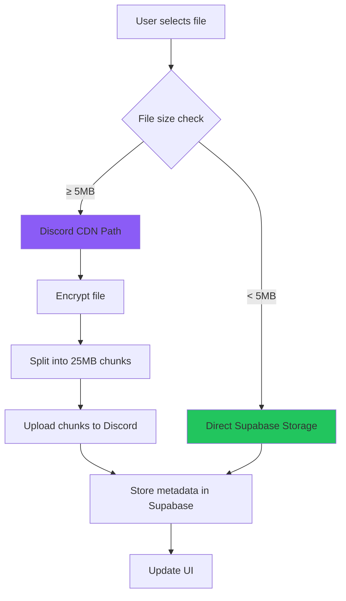
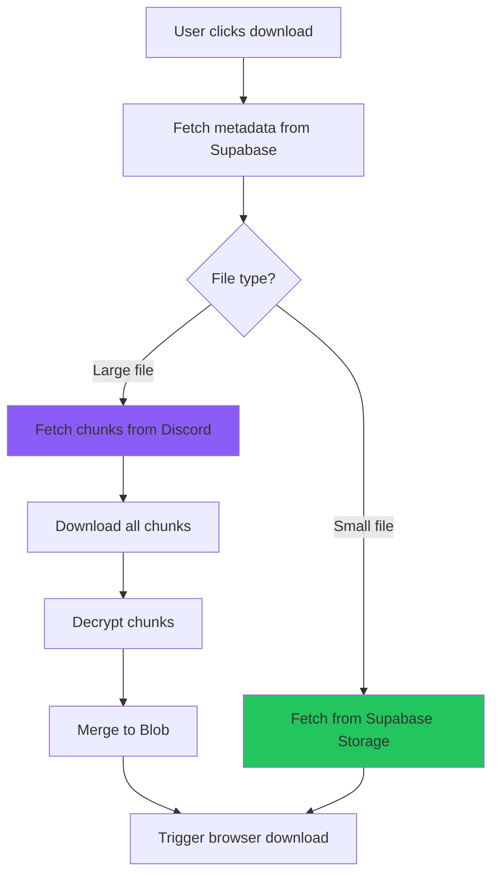
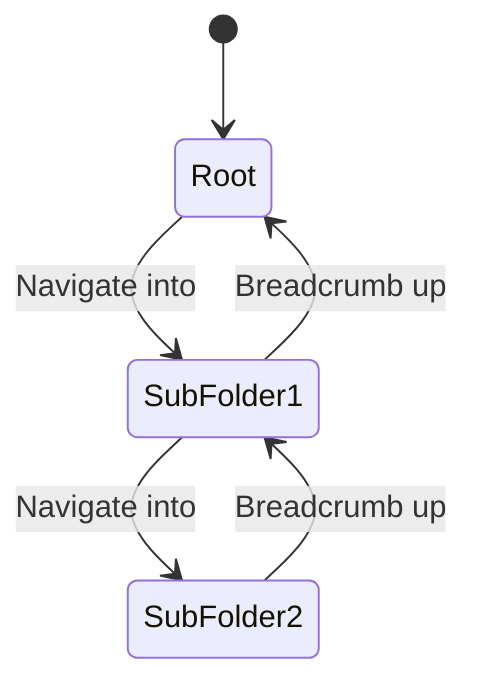
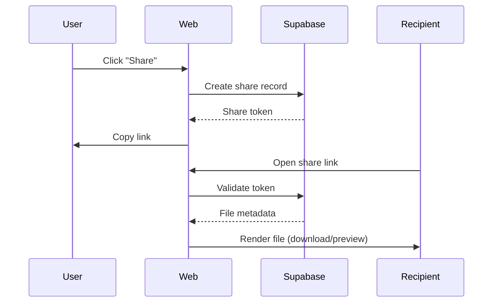
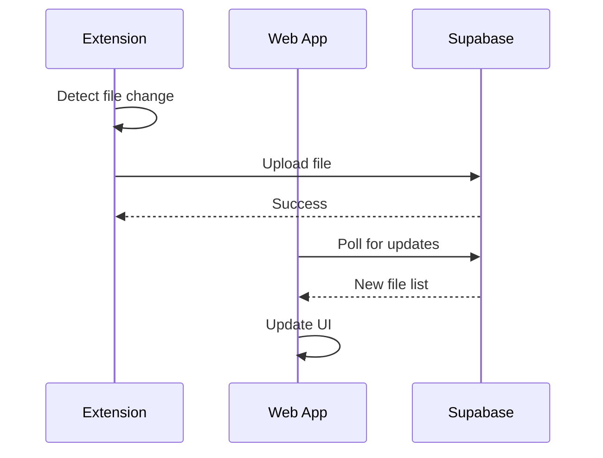

# Data Flow Documentation

> **Last Updated:** 2025-12-18

---

## Overview

This document details how data moves through the Wyvern Drive system, from user actions to storage and retrieval. Understanding these flows is critical for debugging, optimization, and architectural decisions.

---

## 1. File Upload Flow

### High-Level Process



### Detailed Steps (Large File via Discord)

**1. Client-Side Processing**

```typescript
// 1.1: User selects file
const file: File = event.target.files[0];

// 1.2: Generate encryption key (if encrypted)
const salt = crypto.getRandomValues(new Uint8Array(16));
const key = await deriveKey(userPassword, salt);

// 1.3: Encrypt file
const encryptedBlob = await encryptFile(file, key);

// 1.4: Chunk file (25MB chunks)
const chunks = splitIntoChunks(encryptedBlob, 25 * 1024 * 1024);
```

**2. Discord Upload**

```typescript
// 2.1: For each chunk
for (const chunk of chunks) {
  // 2.2: Create FormData
  const formData = new FormData();
  formData.append('file', chunk, `chunk_${index}.bin`);

  // 2.3: Upload via webhook
  const response = await fetch(webhookURL, {
    method: 'POST',
    body: formData
  });

  // 2.4: Extract CDN URL from response
  const cdnURL = response.attachments[0].url;
  chunkURLs.push(cdnURL);
}
```

**3. Metadata Storage**

```typescript
// 3.1: Store in Supabase
await supabase.from('files').insert({
  id: generateUUID(),
  user_id: currentUser.id,
  name: file.name,
  size: file.size,
  type: file.type,
  chunks: chunkURLs,
  encryption_salt: salt,
  created_at: new Date(),
  folder_id: currentFolderId
});
```

**4. UI Update**

```typescript
// 4.1: Add to local state
fileStore.addFile(newFile);

// 4.2: Show success toast
showToast('File uploaded successfully');
```

---

### Error Handling

| Error | Cause | Recovery |
|-------|-------|----------|
| **Chunk upload fail** | Discord rate limit | Exponential backoff retry |
| **Encryption fail** | Invalid password | Prompt user to retry |
| **Metadata save fail** | Supabase error | Rollback Discord uploads |
| **Network timeout** | Slow connection | Pause/resume support |

---

## 2. File Download Flow

### High-Level Process



### Detailed Steps (Large File from Discord)

**1. Metadata Retrieval**

```typescript
// 1.1: Fetch file metadata
const { data: file } = await supabase
  .from('files')
  .select('*')
  .eq('id', fileId)
  .single();

// 1.2: Parse chunk URLs
const chunkURLs = file.chunks; // Array of Discord CDN URLs
```

**2. Chunk Download**

```typescript
// 2.1: Download chunks in parallel (with concurrency limit)
const chunkBlobs = await Promise.all(
  chunkURLs.map(async (url) => {
    const response = await fetch(url);
    return await response.blob();
  })
);
```

**3. Decryption**

```typescript
// 3.1: Derive decryption key
const key = await deriveKey(userPassword, file.encryption_salt);

// 3.2: Decrypt each chunk
const decryptedChunks = await Promise.all(
  chunkBlobs.map(chunk => decryptChunk(chunk, key))
);
```

**4. Assembly and Download**

```typescript
// 4.1: Merge chunks into single Blob
const mergedBlob = new Blob(decryptedChunks, { type: file.type });

// 4.2: Trigger download
const url = URL.createObjectURL(mergedBlob);
const a = document.createElement('a');
a.href = url;
a.download = file.name;
a.click();
URL.revokeObjectURL(url);
```

---

## 3. Folder Navigation Flow

### State Management



### Data Flow

**1. Initial Load**

```typescript
// Fetch root folder contents
const { data: files } = await supabase
  .from('files')
  .select('*')
  .eq('folder_id', null)
  .eq('user_id', currentUser.id);
```

**2. Navigate Into Folder**

```typescript
// 2.1: Update navigation state
navigationStore.push(folderId);

// 2.2: Fetch folder contents
const { data: files } = await supabase
  .from('files')
  .select('*')
  .eq('folder_id', folderId);

// 2.3: Update UI
fileStore.setFiles(files);
```

**3. Breadcrumb Navigation**

```typescript
// 3.1: User clicks breadcrumb at index N
navigationStore.popTo(N);

// 3.2: Re-fetch that folder's contents
const folderId = navigationStore.current();
// ... (same as step 2.2)
```

---

## 4. File Sharing Flow

### Public Share



### Data Flow

**1. Share Creation**

```typescript
// 1.1: Generate share token
const shareToken = generateSecureToken();

// 1.2: Store share record
await supabase.from('shares').insert({
  id: shareToken,
  file_id: fileId,
  created_by: currentUser.id,
  expires_at: new Date(Date.now() + 7 * 24 * 60 * 60 * 1000), // 7 days
  is_public: true
});

// 1.3: Return shareable URL
const shareURL = `https://wyvern-drive.app/share/${shareToken}`;
```

**2. Share Access**

```typescript
// 2.1: Extract token from URL
const token = window.location.pathname.split('/').pop();

// 2.2: Validate and fetch
const { data: share } = await supabase
  .from('shares')
  .select('*, files(*)')
  .eq('id', token)
  .single();

// 2.3: Check expiration
if (new Date(share.expires_at) < new Date()) {
  throw new Error('Share expired');
}

// 2.4: Render file or allow download
renderFilePreview(share.files);
```

---

## 5. Extension ↔ Web Sync Flow

### Background Sync



### Data Flow

**1. Extension File Upload**

```typescript
// Extension background script
chrome.storage.local.get(['authToken'], async ({ authToken }) => {
  // Use same upload flow as web app
  await uploadFileToSupabase(file, authToken);
});
```

**2. Web App Sync**

```typescript
// Web app polling (or Supabase realtime subscriptions)
const channel = supabase
  .channel('file-changes')
  .on('postgres_changes',
    { event: 'INSERT', schema: 'public', table: 'files' },
    (payload) => {
      fileStore.addFile(payload.new);
    }
  )
  .subscribe();
```

---

## 6. Versioning Flow

### Version Creation

```typescript
// When user uploads file with existing name
const existingFile = await supabase
  .from('files')
  .select('*')
  .eq('name', newFile.name)
  .eq('folder_id', folderId)
  .single();

if (existingFile) {
  // Create version record
  await supabase.from('versions').insert({
    file_id: existingFile.id,
    version_number: existingFile.version + 1,
    chunks: newChunkURLs,
    size: newFile.size,
    created_at: new Date()
  });

  // Update file record
  await supabase.from('files')
    .update({ version: existingFile.version + 1 })
    .eq('id', existingFile.id);
}
```

---

## Performance Considerations

### Optimization Strategies

| Flow | Optimization | Impact |
|------|--------------|--------|
| **Upload** | Parallel chunk upload | 3x faster for large files |
| **Download** | Concurrent fetch (limit 6) | 2x faster, avoids rate limits |
| **Navigation** | Client-side caching | Instant folder switching |
| **Sync** | Realtime subscriptions | Sub-second update latency |

### Bottlenecks

- **Discord rate limits:** 5 req/2s per webhook
- **Network latency:** 100-500ms per chunk fetch
- **Encryption overhead:** ~50ms per MB

---

## Related Documentation

- **Architecture:** [System Overview](file:///d:/COMPROG/Wyvern%20Drive/docs/Architecture/system-overview.md)
- **Features:**
  - [File Upload](file:///d:/COMPROG/Wyvern%20Drive/docs/Features/file-upload.md)
  - [Folder Operations](file:///d:/COMPROG/Wyvern%20Drive/docs/Features/folder-operations.md)
