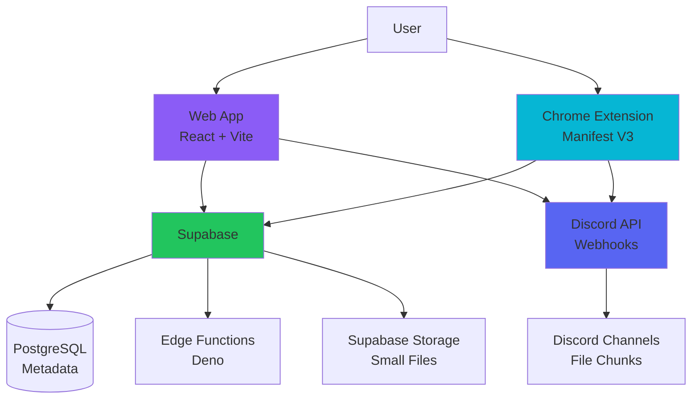
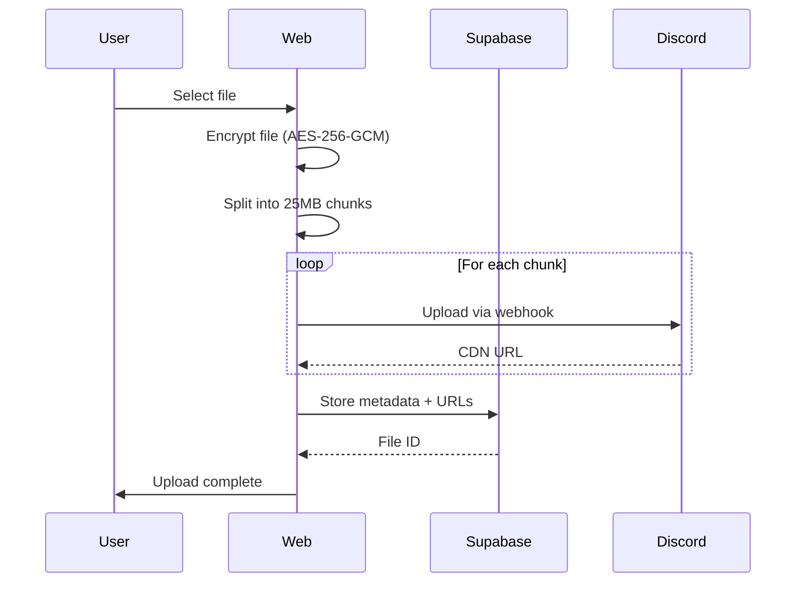
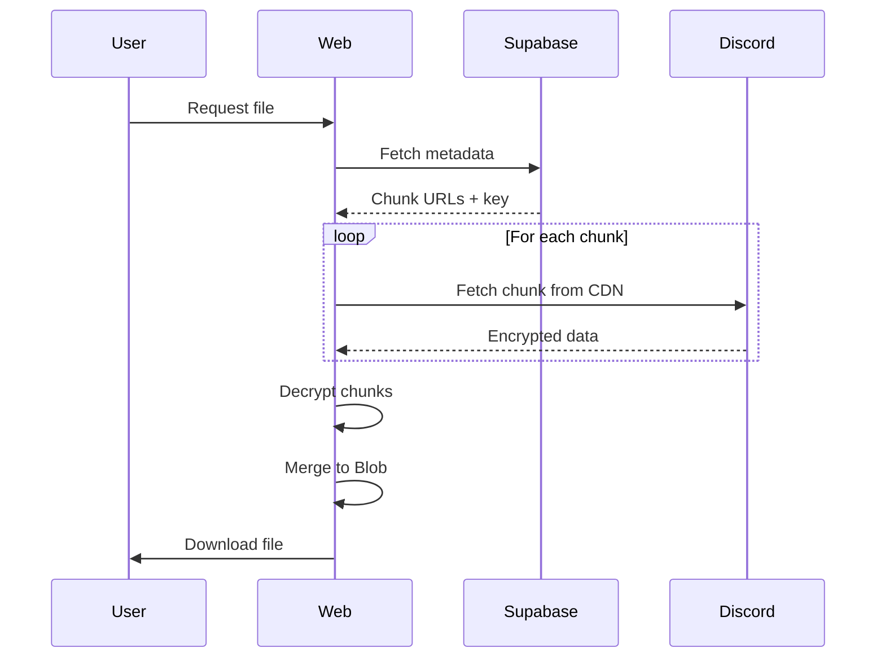

# System Architecture Overview

> **Last Updated:** 2025-12-18
> **Version:** 1.0

---

## High-Level Architecture

Wyvern Drive is a distributed cloud storage system leveraging Discord's infrastructure for object storage, Supabase for metadata management, and a Chrome extension for seamless integration.

---

## Technology Stack

### Frontend

| Component | Technology | Version | Purpose |
|-----------|-----------|---------|---------|
| **Web App** | Vite + React 18 | Latest | Main user interface |
| **Language** | TypeScript | 5.x | Type safety |
| **State Management** | Zustand | 4.x | Client state |
| **Styling** | Vanilla CSS + CSS Modules | - | Design system |
| **Build Tool** | Vite | 5.x | Fast dev/build |

### Backend

| Component | Technology | Version | Purpose |
|-----------|-----------|---------|---------|
| **Database** | PostgreSQL (Supabase) | 15.x | Metadata storage |
| **Auth** | Supabase Auth | Latest | User authentication |
| **Edge Functions** | Deno | Latest | Serverless compute |
| **File Storage (Small)** | Supabase Storage | Latest | Shares < 5MB |
| **File Storage (Large)** | Discord CDN | - | Encrypted chunks |

### Browser Extension

| Component | Technology | Purpose |
|-----------|-----------|---------|
| **Manifest** | Manifest V3 | Chrome extension |
| **Background** | Service Worker | File monitoring |
| **Content Script** | JavaScript | Page integration |

---

## System Components

### 1. Web Application (`wyvern-web/`)

**Responsibility:** Primary user interface for file management.

**Key Features:**
- File upload/download
- Folder navigation
- File versioning
- Sharing (public/private)
- Settings management

**Deployment:** Netlify (static hosting)

---

### 2. Chrome Extension (`wyvern-extension/`)

**Responsibility:** Browser integration for seamless file access.

**Key Features:**
- Context menu integration
- File monitoring
- Background sync
- Thumbnail generation

**Distribution:** Chrome Web Store

---

### 3. Supabase Backend

**Responsibility:** Metadata management, authentication, small file storage.

**Database Tables:**
- `files` — File metadata (name, size, type, chunks)
- `folders` — Folder hierarchy
- `shares` — Public/private sharing
- `versions` — File version history

**Edge Functions:**
- `file-operations` — CRUD operations
- `share-handler` — Share link generation
- `cleanup` — Expired share cleanup (cron)

---

### 4. Discord Infrastructure

**Responsibility:** Durable object storage for encrypted file chunks.

**Implementation:**
- Files are encrypted client-side
- Split into 25MB chunks
- Uploaded via Discord webhooks
- Stored in private Discord channels
- CDN delivers chunks on download

**Rate Limits:**
- 5 requests per 2 seconds per webhook
- Chunked retry logic handles failures

---

## Data Flow

### Upload Flow

### Download Flow

---

## Security Architecture

### Encryption

**Algorithm:** AES-256-GCM
**Key Derivation:** User password via PBKDF2
**IV:** Random per file

**Flow:**
1. User provides password (optional)
2. Key derived from password + salt
3. File encrypted client-side
4. Only encrypted data sent to Discord
5. Decryption key stored in Supabase (encrypted at rest)

### Authentication

**Provider:** Supabase Auth
**Methods:** Email/password, OAuth (future)
**Session Management:** JWT tokens with auto-refresh

### Authorization

**Row-Level Security (RLS):**
- Users can only access their own files
- Shared files have temporary access tokens
- Extension uses same auth context

---

## Deployment Architecture

### Web App

**Platform:** Netlify
**Build Command:** `npm run build`
**Output Directory:** `dist/`
**Environment Variables:**
- `VITE_SUPABASE_URL`
- `VITE_SUPABASE_ANON_KEY`

### Extension

**Platform:** Chrome Web Store
**Build Command:** Manual zip
**Permissions:** `storage`, `contextMenus`, `tabs`

### Supabase

**Hosting:** Supabase Cloud (managed)
**Region:** [To be specified]
**Plan:** Free tier (current)

---

## Scalability Considerations

### Current Limits

| Resource | Limit | Notes |
|----------|-------|-------|
| File Size | 500MB | Discord chunk limit |
| Storage | Unlimited | Discord CDN |
| Users | 100 | Supabase free tier |
| API Calls | 500k/month | Supabase free tier |

### Scaling Plan

**Phase 1 (Current):** Single-user, proof of concept
**Phase 2:** Multi-user, premium tiers
**Phase 3:** Enterprise features, self-hosting option

---

## Monitoring and Observability

### Metrics Tracked

- Upload/download success rate
- Average file processing time
- Discord API rate limit hits
- Supabase query performance
- Extension active users

### Logging

**Client-Side:** Console errors suppressed in production
**Server-Side:** Supabase Edge Function logs
**Discord:** Webhook delivery logs

---

## Disaster Recovery

### Backup Strategy

**Database:** Supabase automatic backups (daily)
**Files:** Discord CDN (durable, replicated)
**Code:** Git repository (GitHub)

### Recovery Procedures

1. **Database Corruption:** Restore from Supabase backup
2. **Discord Webhook Failure:** Retry logic with exponential backoff
3. **Data Loss:** No local state; all data recoverable from Supabase

---

## Related Documentation

- **ADRs:**
  - [ADR-001: Why Discord for storage](file:///d:/COMPROG/Wyvern%20Drive/docs/ADR/decisions.md)
- **Features:**
  - [File Upload](file:///d:/COMPROG/Wyvern%20Drive/docs/Features/file-upload.md)
- **Operations:**
  - [Deployment](file:///d:/COMPROG/Wyvern%20Drive/docs/Operations/deployment.md)
  - [Monitoring](file:///d:/COMPROG/Wyvern%20Drive/docs/Operations/monitoring.md)
