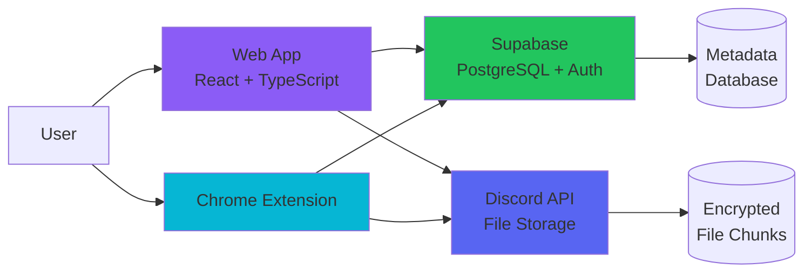

# Wyvern Drive Documentation

> **MCAF-Compliant Repository**
> **Last Updated:** 2025-12-18

---

## Quick Start

**New to Wyvern Drive?**
1. Read [System Overview](./Architecture/system-overview.md)
2. Follow [Development Setup](./Development/setup.md)
3. Review [AGENTS.md](../AGENTS.md) for AI agent rules

**Want to contribute?**
1. Check [ROADMAP.md](./ROADMAP.md) for planned features
2. Use [templates](./templates/) for new docs
3. Follow [Testing Strategy](./Testing/strategy.md)

---

## Documentation Structure

### 📚 [Features](./Features/)
Feature specifications with user flows, test cases, and Definition of Done.

**Key Features:**
- [File Upload](./Features/file-upload.md)
- [Folder Operations](./Features/folder-operations.md)
- [File Move/Edit](./Features/file-move-edit.md)
- [Navigation UX](./Features/navigation-ux.md)

### 📐 [Architecture](./Architecture/)
System design, data flows, and technical decisions.

- [System Overview](./Architecture/system-overview.md) — Components, tech stack, deployment
- [Data Flow](./Architecture/data-flow.md) — Upload, download, sync flows with diagrams

### 📋 [ADR](./ADR/)
Architecture Decision Records documenting significant technical choices.

- [Decisions](./ADR/decisions.md) — Why Discord for storage, encryption strategy, database choice

### 🎨 [Design](./Design/)
Design system, UI/UX guidelines, and quality standards.

- [Design System](../design-system.md) — Colors, typography, components
- [UI/UX Laws](./Design/ui-ux-laws.md) — Cognitive psychology principles
- [Accessibility Checklist](./Design/accessibility-checklist.md) — WCAG AA compliance
- [Quality Checklist](./Design/quality-checklist.md) — "Can't Unsee" visual review

### 🧪 [Testing](./Testing/)
Test strategy, coverage expectations, and mocking guidelines.

- [Strategy](./Testing/strategy.md) — MCAF-compliant testing discipline

### 🚀 [Operations](./Operations/)
Deployment, monitoring, and incident response.

- [Deployment](./Operations/deployment.md) — Netlify, Supabase, Chrome Web Store
- [Monitoring](./Operations/monitoring.md) — KPIs, alerts, runbooks

### 🛠️ [Development](./Development/)
Local setup, tools, and workflow.

- [Setup Guide](./Development/setup.md) — How to run locally

### 📝 [Templates](./templates/)
Standardized templates for creating new documentation.

- [Feature Template](./templates/Feature-Template.md)
- [ADR Template](./templates/ADR-Template.md)
- [Test Template](./templates/Test-Template.md)

---

## What is Wyvern Drive?

Wyvern Drive is a **Discord-based cloud storage service** with modern UX and enterprise-grade security.

### Key Features

- ✨ **Modern UI/UX** — Dark mode, fluid animations, drag-and-drop, mobile-first
- 🔒 **Client-side Encryption** — AES-256-GCM before upload (zero-knowledge)
- 📁 **Folder Operations** — Upload/download/delete entire directory trees
- 🕰️ **File Versioning** — Track changes and restore previous versions
- ✏️ **Full File Management** — Move, rename, delete with undo support
- 🌐 **Public/Private Sharing** — Generate shareable links with expiration
- 🔌 **Chrome Extension** — Right-click to upload from any webpage

### How It Works

**Upload Flow:**
1. File encrypted client-side (AES-256-GCM)
2. Split into 25MB chunks
3. Chunks uploaded to Discord via webhooks
4. Metadata stored in Supabase PostgreSQL

**Download Flow:**
1. Fetch metadata from Supabase
2. Download chunks from Discord CDN
3. Decrypt and merge client-side
4. Trigger browser download

---

## Architecture at a Glance

| Component | Technology | Purpose |
|-----------|-----------|---------|
| **Web App** | Vite + React 18 + TypeScript | Main UI |
| **Extension** | Chrome Manifest V3 | Browser integration |
| **Database** | PostgreSQL (Supabase) | Metadata |
| **Auth** | Supabase Auth | User management |
| **Storage** | Discord CDN | Encrypted file chunks |
| **Edge Functions** | Deno (Supabase) | Serverless compute |
| **Hosting** | Netlify | Static site hosting |

**Why Discord for storage?**
See [ADR: Why Discord](./ADR/decisions.md) for the full rationale.

---

## Design Philosophy

Wyvern Drive follows the **"Obsidian Minimal"** design system:

- **Content First** — UI recedes; user files take center stage
- **Depth Through Subtlety** — Hierarchy via opacity, not heavy shadows
- **Monochrome + Accent** — Near-black surfaces with high-contrast accents
- **Motion as Meaning** — Micro-animations signal responsiveness

Read more in [Design System](../design-system.md).

---

## Development Standards

Wyvern Drive follows **[MCAF](https://mcaf.managed-code.com/)** (Managed Code AI Framework):

✅ **Context** — All information lives in the repository
✅ **Verification** — Tests and static analysis are decision makers
✅ **Instructions** — AGENTS.md defines how AI agents work here

**Before making any changes:**
1. Read [AGENTS.md](../AGENTS.md)
2. Check relevant feature docs in `docs/Features/`
3. Review applicable ADRs in `docs/ADR/`

---

## Contributing

### Creating New Features

1. **Document first:** Use [Feature Template](./templates/Feature-Template.md)
2. **Get feedback:** Discuss design in feature doc
3. **Implement with tests:** Integration tests alongside code
4. **Update docs:** Keep feature docs in sync with implementation

### Making Architectural Changes

1. **Document decision:** Use [ADR Template](./templates/ADR-Template.md)
2. **Consider alternatives:** Explain why this approach was chosen
3. **Assess consequences:** Be honest about trade-offs

### Writing Tests

See [Testing Strategy](./Testing/strategy.md) for:
- Coverage expectations
- Mocking guidelines (no mocks for internal systems)
- Test quality standards

---

## Key Resources

- **[ROADMAP.md](./ROADMAP.md)** — Planned features and milestones
- **[VISION.md](./VISION.md)** — Product vision and long-term goals
- **[COMPETITIVE_ANALYSIS.md](./COMPETITIVE_ANALYSIS.md)** — How we compare to alternatives
- **[API.yaml](./API.yaml)** — OpenAPI specification for backend

---

## External Links

- **GitHub Repository:** [Zendevve/Wyvern-Drive](https://github.com/Zendevve/Wyvern-Drive)
- **Live Demo:** [wyvern-drive.netlify.app](https://wyvern-drive.netlify.app)
- **MCAF Framework:** [mcaf.managed-code.com](https://mcaf.managed-code.com/)

---

*This documentation is a living system. Update it as the codebase evolves. AI agents read these docs before making changes.*
