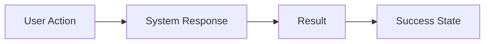

# Feature: [Feature Name]

> **Status:** [Draft | In Development | Complete]
> **Owner:** [Name or Team]
> **Created:** [YYYY-MM-DD]
> **Last Updated:** [YYYY-MM-DD]

---

## Purpose

**What does this feature do, and why does it exist?**

[1-2 paragraph description of the feature's purpose, business value, and how it fits into the overall product vision.]

---

## Business Rules and Constraints

List the core business rules and technical constraints that govern this feature:

- **Rule 1:** [Description]
- **Rule 2:** [Description]
- **Constraint 1:** [e.g., Max file size: 25MB]
- **Constraint 2:** [e.g., Must work offline]

---

## User Flows

### Main Flow (Happy Path)



**Step-by-step:**

1. **User does X** — System responds with Y
2. **User does Z** — System updates state to W
3. **System displays result** — User sees confirmation

### Alternative Flows

**Alt Flow 1: [Name]**

[Describe scenario and steps]

**Alt Flow 2: [Name]**

[Describe scenario and steps]

### Edge Cases

- **Edge Case 1:** [Description and expected behavior]
- **Edge Case 2:** [Description and expected behavior]

---

## Test Flows

### Positive Tests (Happy Path)

**Test 1: [Name]**
- **Prerequisites:** [Initial state, test data]
- **Steps:**
  1. [Action]
  2. [Action]
  3. [Assertion]
- **Expected Result:** [What should happen]

**Test 2: [Name]**
- [Same structure]

### Negative Tests (Error Handling)

**Test 1: [Invalid input scenario]**
- **Prerequisites:** [Setup]
- **Steps:**
  1. [Trigger error condition]
  2. [Verify error message]
- **Expected Result:** [Graceful error handling, no crash]

### Edge Case Tests

**Test 1: [Boundary condition]**
- [Same structure]

---

## UI/UX Specifications

### Visual Design

- **Design System:** Uses components from `docs/design-system.md`
- **Key Components:** [List buttons, modals, cards used]
- **Color Usage:** [Semantic colors for states]

### Accessibility

- [ ] WCAG AA compliant (4.5:1 contrast)
- [ ] Keyboard navigable
- [ ] Screen reader tested
- [ ] Focus management implemented
- [ ] `prefers-reduced-motion` respected

### Interaction Patterns

- **Primary Action:** [CTA button behavior]
- **Secondary Actions:** [Cancel, delete, etc.]
- **Feedback:** [Success toasts, error messages]
- **Response Time:** [Expected load time]

---

## Technical Implementation

### Components/Modules Involved

- `[ComponentName.tsx]` — [Responsibility]
- `[ServiceName.ts]` — [Responsibility]
- `[DatabaseTable]` — [Schema notes]

### Dependencies

- **Internal:** [Other features this depends on]
- **External:** [Third-party APIs, libraries]

### Data Model

```typescript
interface FeatureData {
  id: string;
  // Add fields
}
```

---

## Related Documentation

- **ADRs:**
  - [ADR-001: Architecture decision title](file:///path/to/adr)
- **Features:**
  - [Related Feature Name](file:///path/to/feature)
- **Code:**
  - [ComponentName.tsx](file:///path/to/component)
- **Tests:**
  - [test-suite-name.test.ts](file:///path/to/test)

---

## Definition of Done

This feature is complete when:

- [ ] All main flow scenarios work end-to-end
- [ ] All edge cases are handled gracefully
- [ ] Integration/API tests exist for all flows
- [ ] UI/E2E tests exist for critical user paths
- [ ] Accessibility checklist passes
- [ ] Documentation is updated
- [ ] Static analysis passes
- [ ] Code review approved

---

## Open Questions / Risks

**Question 1:** [What is unclear?]
- **Decision:** [TBD or resolved answer]

**Risk 1:** [What could go wrong?]
- **Mitigation:** [How we address it]

---

*This document should be precise enough that a developer (human or AI) can implement the feature without inventing behavior.*
