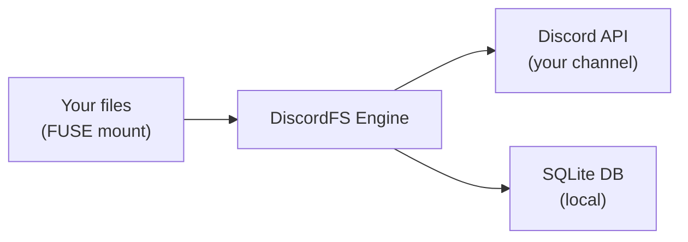

# DiscordFS

A FUSE filesystem that uses Discord as a cloud storage backend. Mount a directory on Linux where files are transparently encrypted, compressed, chunked, and stored as Discord message attachments. Supports multi-instance synchronization across devices.

## How It Works



When you copy a file into the mounted directory:

1. The file is **compressed** with DEFLATE
2. **Encrypted** with AES-256 (password from your `.env`)
3. **Split** into 8 MB chunks (Discord's upload limit)
4. Each chunk is **uploaded** as a Discord message attachment
5. An encrypted **manifest** message is posted with the file metadata
6. Everything is tracked in a local **SQLite database**

When you read a file, the reverse happens: chunks are downloaded, reassembled, decrypted, and decompressed — with a local LRU cache to avoid re-downloading.

---

## Features

- **Transparent FUSE mount** — use `cp`, `mv`, `rm`, `cat`, `ls` normally
- **AES-256 encryption** — all data and metadata encrypted before upload
- **Chunked uploads** — files split into 8 MB chunks for Discord's limit
- **Local LRU cache** — frequently accessed files served from disk cache
- **Multi-instance sync** — mount on multiple machines, changes propagate automatically
- **Resilient uploads** — retry with exponential backoff on Discord API errors
- **Atomic DB operations** — transactions prevent partial/corrupt state
- **Thread-safe** — concurrent FUSE operations handled safely
- **DB rebuild** — reconstruct local database by scanning Discord channel
- **Tombstone deletions** — file deletions propagate across instances
- **Channel purge** — remove tombstones, orphaned chunks, and stale metadata from Discord

---

## Prerequisites

- **Linux** with FUSE support (`sudo apt install fuse3` or equivalent)
- **Python 3.11+**
- A **Discord bot** with:
  - `Send Messages` permission
  - `Read Message History` permission
  - `Manage Messages` permission (for deleting chunks)
  - `Message Content` intent enabled
- A **Discord server** (guild) with a dedicated text channel

### Creating a Discord Bot

1. Go to [Discord Developer Portal](https://discord.com/developers/applications)
2. Click **New Application**, give it a name
3. Go to **Bot** tab → click **Reset Token** → copy the token
4. Under **Privileged Gateway Intents**, enable **Message Content Intent**
5. Go to **OAuth2** → **URL Generator**:
   - Scopes: `bot`
   - Bot Permissions: `Send Messages`, `Read Message History`, `Manage Messages`
6. Open the generated URL to invite the bot to your server
7. Create a dedicated text channel (e.g., `#discordfs-storage`)
8. Right-click the channel → **Copy Channel ID** (enable Developer Mode in Discord settings if needed)

---

## Installation

### Quick Install (recommended)

The installer creates a virtual environment, prompts for your Discord credentials, and sets up a systemd user service for automatic mounting at login:

```bash
git clone https://github.com/GiacoBot/DiscordFS.git
cd DiscordFS
./install.sh
```

After installation:

```bash
# Start the filesystem
systemctl --user start discordfs

# Check status
systemctl --user status discordfs

# View logs
journalctl --user -u discordfs -f

# Stop
systemctl --user stop discordfs
```

The filesystem mounts at `~/DiscordFS` by default and starts automatically at each login.

To uninstall:

```bash
./uninstall.sh
```

### Manual Install

```bash
git clone https://github.com/GiacoBot/DiscordFS.git
cd DiscordFS

# Create virtual environment
python3 -m venv .venv

# Install dependencies
.venv/bin/pip install -e ".[dev]"
```

---

## Configuration

Copy the example environment file and fill in your values:

```bash
cp .env.example .env
```

Edit `.env`:

```env
# Required
DISCORD_BOT_TOKEN=your_bot_token_here
DISCORD_CHANNEL_ID=123456789012345678
DISCORDFS_PASSWORD=your_strong_password_here

# Optional (shown with defaults)
CHUNK_SIZE=8388608          # 8 MB per chunk
MOUNT_POINT=./mnt           # Where to mount the filesystem
DB_PATH=./discordfs.db      # Local SQLite database path
CACHE_DIR=~/.discordfs/cache # LRU cache directory
CACHE_MAX_MB=500            # Max cache size in MB
SYNC_INTERVAL=30            # Seconds between sync polls
SYNC_ENABLED=true           # Enable multi-instance sync
```

### Configuration Reference

| Variable | Required | Default | Description |
|---|---|---|---|
| `DISCORD_BOT_TOKEN` | Yes | — | Your Discord bot token |
| `DISCORD_CHANNEL_ID` | Yes | — | Channel ID for file storage |
| `DISCORDFS_PASSWORD` | Yes | — | AES-256 encryption password |
| `CHUNK_SIZE` | No | `8388608` | Max chunk size in bytes (8 MB) |
| `MOUNT_POINT` | No | `./mnt` | FUSE mount point directory |
| `DB_PATH` | No | `./discordfs.db` | SQLite database file path |
| `CACHE_DIR` | No | `~/.discordfs/cache` | Decrypted file cache directory |
| `CACHE_MAX_MB` | No | `500` | Maximum cache size in MB |
| `SYNC_INTERVAL` | No | `30` | Sync polling interval in seconds |
| `SYNC_ENABLED` | No | `true` | Enable/disable multi-instance sync |

---

## Usage

### Mount the Filesystem

```bash
.venv/bin/discordfs mount
```

The filesystem is now mounted at `./mnt` (or your configured `MOUNT_POINT`). Use it like a normal directory:

```bash
# Copy files in
cp photo.jpg mnt/
cp -r documents/ mnt/

# Read files
cat mnt/notes.txt

# List contents
ls -la mnt/

# Create directories
mkdir mnt/projects

# Rename files
mv mnt/old_name.txt mnt/new_name.txt

# Delete files
rm mnt/unwanted.txt
```

To unmount:

```bash
# Press Ctrl+C in the terminal running discordfs, or:
fusermount -u ./mnt
```

### Mount Options

```bash
# Mount with verbose logging
.venv/bin/discordfs -v mount

# Mount at a custom location
.venv/bin/discordfs mount --mount /tmp/discord-drive

# Mount without multi-instance sync
.venv/bin/discordfs mount --no-sync

# Use a custom .env file
.venv/bin/discordfs --env /path/to/.env mount
```

### Rebuild Database from Discord

If you lose your local database or want to set up on a new machine:

```bash
.venv/bin/discordfs rebuild
```

This scans the entire Discord channel, parses all DFS messages, decrypts manifests, and reconstructs the local database. Files whose manifests can't be decrypted are placed under `/recovered/<uuid>`.

### Purge Orphaned Messages

Remove tombstones, leftover chunks/metadata of deleted files, and orphaned messages from the Discord channel:

```bash
# Preview what would be deleted
.venv/bin/discordfs purge --dry-run

# Actually delete
.venv/bin/discordfs purge
```

Example output:

```
Scanning Discord channel...
Tombstones:          17
Deleted file chunks: 14
Deleted file metas:  14
Orphaned chunks:     2
Orphaned metas:      0
Total to purge:      47
Deleting messages from Discord...
Purge complete.
```

### Show Filesystem Info

```bash
.venv/bin/discordfs info
```

Example output:

```
Files:       12
Directories: 3
Chunks:      47
Total size:  156.32 MB
DB path:     ./discordfs.db
Channel:     1234567890123456789
Instance:    desktop-a1b2c3d4
Last sync:   msg 1483497434868089015
```

---

## Multi-Instance Sync

DiscordFS can be mounted on multiple machines simultaneously. Each instance:

1. Gets a unique **instance ID** (e.g., `laptop-f3a1b2c3`) stored in the local DB
2. Tags all Discord messages with its instance ID (`by=<id>`)
3. **Polls** the channel every 30 seconds for new messages from other instances
4. **Updates** the local DB with any new or modified files
5. **Processes tombstones** to delete files that were removed on another machine

### How Sync Works

```
Machine A                        Discord Channel                    Machine B
─────────                        ───────────────                    ─────────
cp file.txt mnt/ ──────────────▶ [DFS] chunk + manifest ──────▶ (polling)
                                                                    DB updated
                                                                    file.txt appears

rm mnt/file.txt ───────────────▶ [DFS:delete] tombstone ──────▶ (polling)
                                                                    DB updated
                                                                    file.txt removed
```

### Conflict Resolution

If two instances modify the same file simultaneously, **last-writer-wins** — the instance whose message appears later in the Discord channel takes precedence. A warning is logged when conflicts are detected.

### Setting Up a Second Machine

1. Install DiscordFS on the second machine
2. Use the **same** `.env` file (same bot token, channel, and password)
3. Run `discordfs mount` — the initial sync will automatically download the file index from Discord

---

## Architecture

### Project Structure

```
DiscordFS/
├── discordfs/
│   ├── __init__.py          # Package version
│   ├── __main__.py          # CLI entry point (click)
│   ├── config.py            # .env configuration loader
│   ├── crypto.py            # AES-256 encryption/decryption
│   ├── chunker.py           # File splitting/joining
│   ├── utils.py             # Hashing, UUID, instance ID, logging
│   ├── retry.py             # Exponential backoff retry logic
│   ├── db.py                # SQLite database layer
│   ├── discord_store.py     # Discord API interaction
│   ├── fs.py                # FUSE filesystem + LRU cache
│   └── sync.py              # Multi-instance sync manager
├── tests/
│   ├── test_crypto.py       # Encryption round-trip tests
│   ├── test_chunker.py      # Chunk split/join tests
│   ├── test_db.py           # Database CRUD + transaction tests
│   ├── test_retry.py        # Retry logic tests
│   └── test_cache.py        # LRU cache tests
├── pyproject.toml
├── .env.example
├── install.sh              # Automated installer (systemd + venv)
├── uninstall.sh            # Clean removal
├── discordfs.service       # systemd unit reference template
└── .gitignore
```

### Threading Model

- **Main thread**: FUSE filesystem (fusepy, synchronous callbacks)
- **Background thread**: asyncio event loop for discord.py and aiosqlite
- **Communication**: `asyncio.run_coroutine_threadsafe()` bridges sync FUSE calls to async Discord/DB operations
- **Thread safety**: `threading.Lock` protects shared state (file handles, caches)

### Encryption Pipeline

```
Original file
  → Compress (DEFLATE)
  → Encrypt (AES-256 via pyzipper WinZip AES)
  → Split into ≤8 MB chunks
  → Upload each chunk as Discord attachment
```

All encryption uses [pyzipper](https://github.com/danifus/pyzipper) with WinZip AES-256 — significantly stronger than legacy ZIP 2.0 encryption. The inner filename inside the encrypted ZIP is always `data.bin`, never the real filename.

### Discord Message Format

Each file produces multiple Discord messages:

**Chunk messages** (one per chunk):
```
[DFS] file=a3f8c2e1-9b4d-... chunk=1/3 sha256=e3b0c442... ts=1710700000 by=laptop-f3a1b2c3
```
- Attachment: `a3f8c2e1-9b4d-..._0.bin` (encrypted chunk data)

**Manifest message** (one per file):
```
[DFS:meta] file=a3f8c2e1-9b4d-... ts=1710700000 by=laptop-f3a1b2c3
```
- Attachment: `a3f8c2e1-9b4d-..._meta.bin` (encrypted JSON with path, size, mode)

**Tombstone message** (on deletion):
```
[DFS:delete] file=a3f8c2e1-9b4d-... ts=1710700000 by=laptop-f3a1b2c3
```
- No attachment — lightweight deletion signal

### SQLite Schema

```sql
files       — file_uuid, path, size_bytes, sha256, total_chunks, timestamps, mode
chunks      — file_uuid, chunk_index, discord_msg_id, size_bytes
dirs        — path, created_at, mode
manifests   — file_uuid, discord_msg_id
sync_meta   — key/value pairs (instance_id, last_known_msg_id)
```

The database uses WAL (Write-Ahead Logging) mode for concurrent access and enforces foreign key constraints with `ON DELETE CASCADE`.

### Retry Logic

Discord API calls use exponential backoff with jitter:

| Error | Behavior |
|---|---|
| HTTP 429 (rate limited) | Sleep for `retry_after`, retry (unlimited) |
| HTTP 5xx (server error) | Retry with backoff (max 4 retries) |
| Connection/timeout error | Retry with backoff (max 4 retries) |
| HTTP 401/403/404 | Fail immediately (not retryable) |

Backoff formula: `delay = base_delay × 2^attempt + random(0, 0.5s)`

### Upload Safety (Upload-Then-Swap)

When overwriting a file, DiscordFS uses a safe two-phase approach:

1. **Upload** all new chunks first
2. **Only then** delete old chunks and update the DB in a single transaction
3. If upload fails midway, partially uploaded chunks are cleaned up and the old file remains intact

---

## Security Considerations

### What Is Protected

- **File content**: AES-256 encrypted — unreadable without the password
- **File metadata** (names, paths, sizes): Encrypted in manifest attachments
- **Discord messages**: Only contain opaque UUIDs, SHA-256 hashes, and timestamps

### What Is NOT Protected

- **File existence**: Anyone in the Discord channel can see that files exist (encrypted blobs)
- **File count and sizes**: Chunk counts and sizes are visible in message text
- **Upload timestamps**: Visible in Discord messages
- **Access patterns**: Discord can see when you upload/download

### Risks

- **Single password**: If compromised, all files are exposed. Use a strong, unique password.
- **Discord Terms of Service**: Using Discord as file storage may violate their ToS. Use at your own risk.
- **Bot token**: If compromised, an attacker can read/delete all your stored files. Keep your `.env` secure.
- **No forward secrecy**: Changing the password does not re-encrypt existing files.
- **Metadata in memory**: The password and decrypted data exist in memory while the filesystem is mounted.
- **Decrypted cache on disk**: The LRU cache (`~/.cache/discordfs/`) stores files in cleartext. Anyone with disk access can read them. Use full-disk encryption (e.g., LUKS) to mitigate. Set `CACHE_MAX_MB=0` to disable the cache entirely.
- **Database paths in cleartext**: The local SQLite database stores file paths unencrypted, revealing your directory structure to anyone with disk access.
- **Swappable memory**: The encryption password lives in Python memory and may be paged to swap. Use encrypted swap on sensitive systems.

### Recommendations

- Use a strong password (20+ characters, random)
- Never commit your `.env` file to version control
- Restrict Discord channel permissions to only your bot
- Use full-disk encryption (LUKS) to protect the local cache and database
- Restrict file permissions: `chmod 600` on your `.env` and `.db` files
- Consider this a **hobby/experimental project**, not a production storage solution

---

## Running Tests

```bash
.venv/bin/pytest tests/ -v
```

Test coverage includes:
- Encryption/decryption round-trips (including wrong password)
- Chunk splitting/joining with edge cases
- Database CRUD operations, transactions, and rollback
- Retry logic with connection errors, timeouts, and HTTP errors
- LRU cache hit/miss, eviction, and invalidation

---

## Dependencies

| Package | Version | Purpose |
|---|---|---|
| [discord.py](https://github.com/Rapptz/discord.py) | ≥2.3 | Discord bot framework |
| [fusepy](https://github.com/fusepy/fusepy) | ≥3.0 | FUSE filesystem bindings |
| [pyzipper](https://github.com/danifus/pyzipper) | ≥0.3 | AES-256 ZIP encryption |
| [aiosqlite](https://github.com/omnilib/aiosqlite) | ≥0.19 | Async SQLite driver |
| [python-dotenv](https://github.com/theskumar/python-dotenv) | ≥1.0 | Environment variable loader |
| [click](https://github.com/pallets/click) | ≥8.1 | CLI framework |

---

## Limitations

- **Speed**: Every write requires uploading to Discord. Large files take time. The LRU cache helps with reads.
- **8 MB chunk limit**: Discord's attachment size limit. A 100 MB file = 13 chunks = 13 API calls.
- **Rate limits**: Discord rate limits apply. Bulk operations (many files at once) may be throttled.
- **No partial writes**: Files use write-on-close semantics — the entire file is uploaded when you close it.
- **No symlinks**: Symbolic links are not supported.
- **No hard links**: Hard links are not supported.
- **No extended attributes**: xattr not supported.
- **Directory-only local**: Directories exist only in the local DB, not on Discord. The `rebuild` command cannot restore empty directories.

---

## License

This project is provided as-is for educational and experimental purposes.
